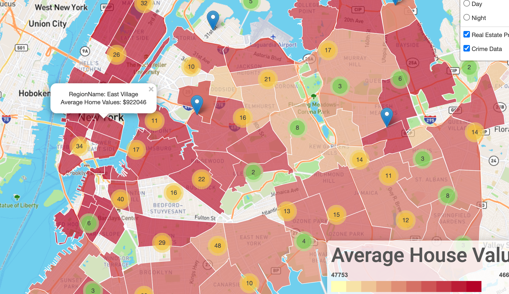
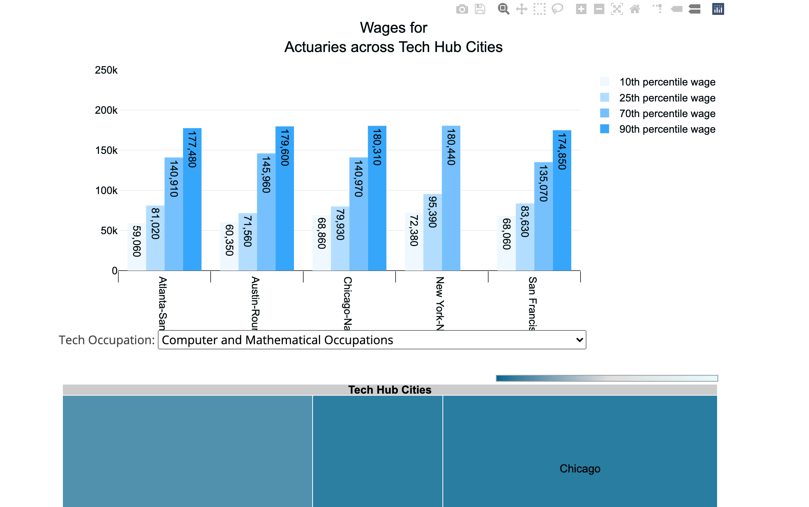

Welcome to our App!
===================

[Tech Hub Website](https://tech-hub-wars.herokuapp.com/)
--------------------------------------------------------

 

Project Proposal
----------------

Our team set out to identify the factors that contribute to the success of
existing tech cities in the United States with the long-term goal of finding the
next emerging tech hub. In tackling this project, we analyzed the following
well-known tech hubs:

-   San Francisco, California

-   Chicago, Illonois

-   New York City, New York

-   Austin, Texas

-   Atlanta Georgia

We selected the following factors to analyze:

-   Tech-related employment ([Bureau of Labor Statistics](https://www.bls.gov/))

-   Wages ([Bureau of Labor Statistics](https://www.bls.gov/))

-   Real estate value
    ([Zillow](https://www.zillow.com/howto/api/APIOverview.htm))

-   Crime (Government OpenData)

 

Gathering data
--------------

Our objective was to find usable data from the data sources listed above and
make readable in a JSON format to work with our JavaScript visualization
libraries. Our approach starts with gathering CSV or JSON files.

 

Data Manipulation
-----------------

The data files gathered from BLS and Crime data was cleaned in an appropriate
structure to create the end visualizations. However, the real estate data
required cleaning before use. In making manipulations, we imported a CSV and
geojson file into a pandas dataframe. The CSV contained the real estate value of
the city of interest drilled down by neighborhoods. We used a geojson file to
create choropleth map of the same neighborhood names. This required to merge the
data frames on the neighborhood names.

 

Data Loading
------------

From here, all the data was loaded in MongoDB Atlas - a NoSQL cloud database.
With the data in MongoDB Atlas, the data now can be directly access quickly from
our Flask application and get converted to a json object to be read by
Javascript.

 

Data Visualization
------------------

### Leaflet.js Map

#### Choropleth Layer

The geojson for each neighborhood was merged with a data frame. This data was
used to plot a choropleth overlay on Leaflet.

#### Crime Marker Clusters

Json with crime data were obtained from open data portals from four of the five
tech hub cities. After parsing through the data to find the coordinates, we used
L.marker to create the crime markers.

#### Interactions 

-   Clusters

-   Markers

-   Drop down

-   Toggle Later

 

### Plotly & Google Chart

#### Bar chart/Treemap

The jsonified data was read by JavaScript and unpacked into the javascript
libraries.

#### Interactions

-   Drop down by occupation

-   Clickable filters by wage percentiles

-   Double-click into city for occupation volume data

 

Insights
--------

-   Crime was expected to occur more in areas of poverty, but appeared even
    across all real estate pricing values

-   In areas with the highest real estate prices, the top criminal activities
    were

    -   Dangerous drugs

    -   Petit Larceny

    -   Offenses related to theft

-   Of the 5 tech hubs, NYC holds the highest employment in tech at 38%.
    Followed by:

    -   San Francisco (20%)

    -   Chicago (18%)

    -   Atlanta (16%)

    -   Austin (8%)

-   Largest employed occupation in tech are Software Developers and Software
    Quality Assurance Analysts

-   Lowest employed occupation in tech are Mathematicians and Actuaries
